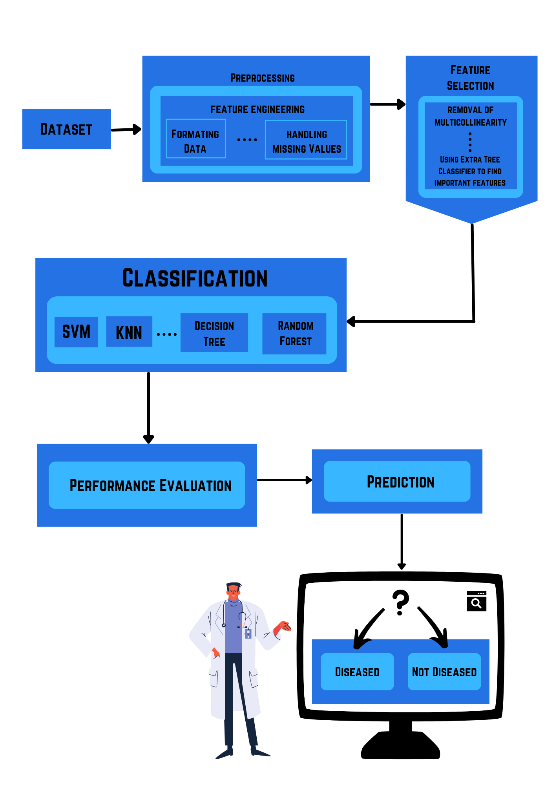
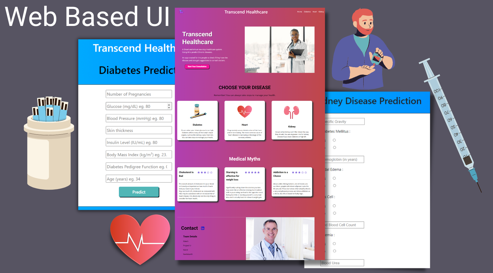
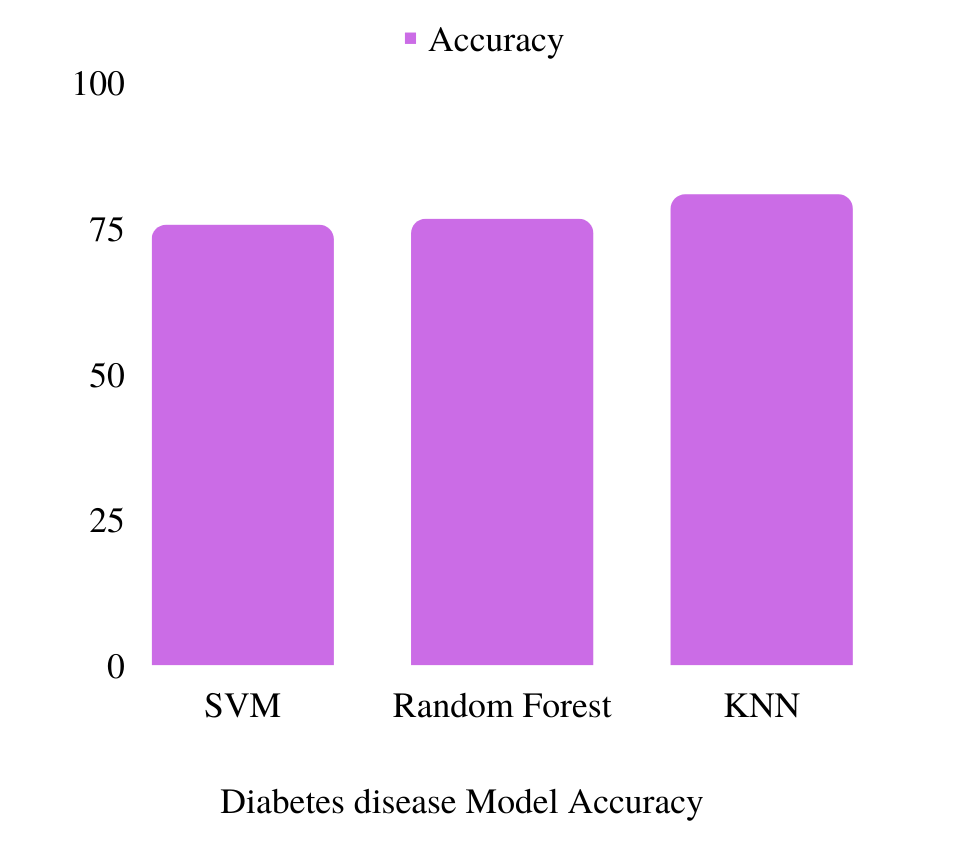
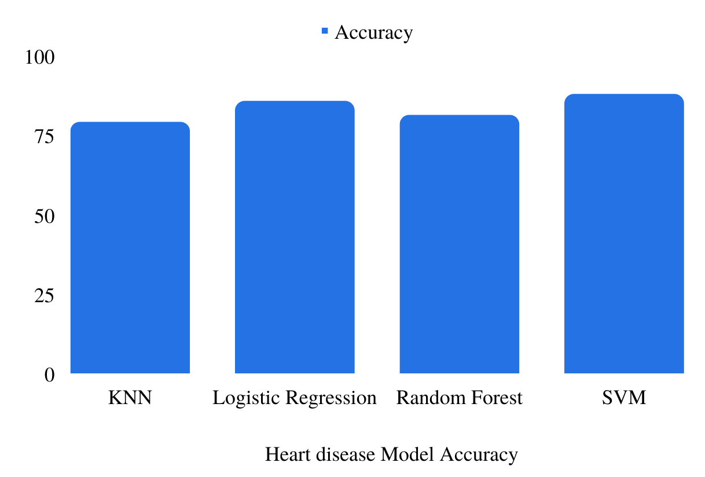
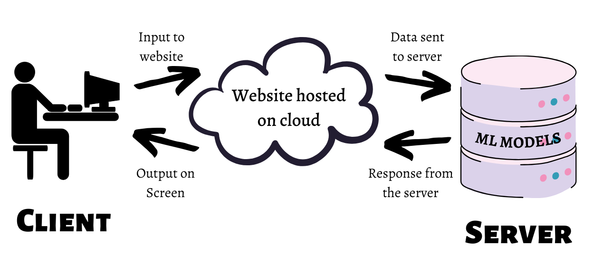

# Transcend-Health
One Stop Healthcare System Multi-disease Predictor.

## Architecture 

Followed this MLOPS pipeline for this project.

## Dataset Used

### Kidney Disease Dataset:
- 400 entries, 25 Characteristics
- Attributes: Age, hemoglobin, appetite, blood pressure, diabetes, sugar, red blood cells, etc.
- Diagnostic class: CKD (yes/no)
- Missing entries in all features except diagnosis
### Diabetes Dataset:
- 768 entries, 9 Characteristics
- Attributes: Age, blood pressure, pregnancy, hyperglycemia, etc.
- Diagnostic class: 0 or 1
- Some missing values in some features
### Heart Disease Dataset:
- 303 entries, 14 Characteristics
- Attributes: Age, chest discomfort, blood pressure, sex, etc.
- Diagnostic class: 0 or 1
- No missing values in any features

## UI for Website

## Accuracy achieved from multiple models
  

## Hosted on Heroku
###### -- Not live now.

